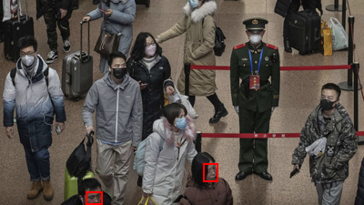
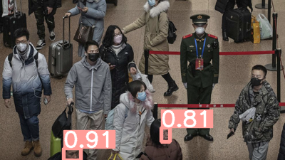
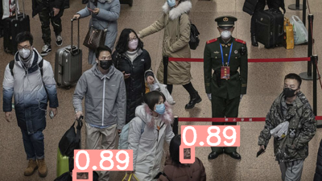
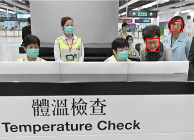
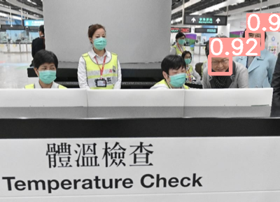
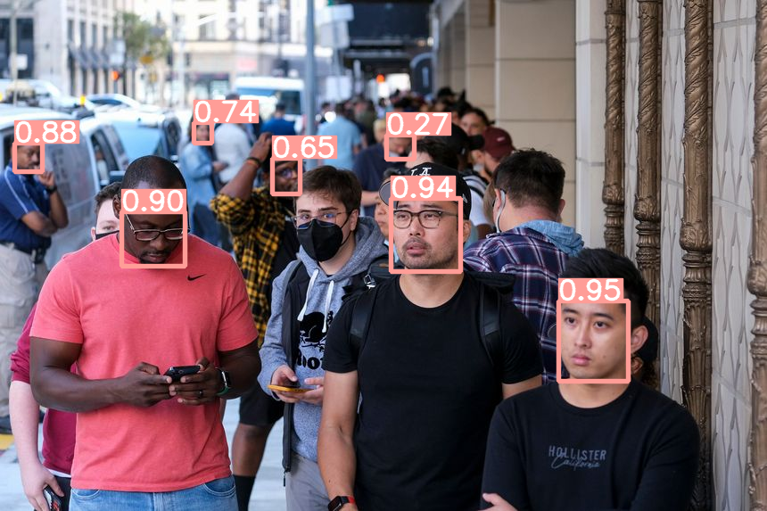
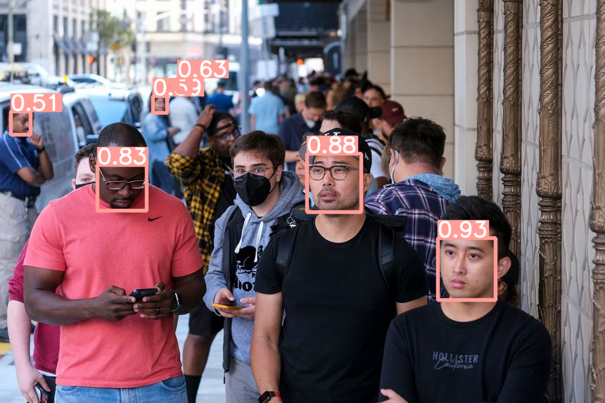

# Object detection model for non-wearing mask people.     
This project proposes an AI object detection model using the YOLOv5 architecture to identify individuals not wearing masks. The model was trained on a dataset of images and achieved accurate results in identifying people not wearing masks.

## Dataset
The model was trained on [Dataset](https://www.kaggle.com/andrewmvd/face-mask-detection) dataset which contains 853 images belonging to 3 classes, as well as their bounding boxes in the PASCAL VOC format. The classes are defined as follows:
* `With mask`
* `Without mask`
* `Mask worn incorrectly`

## Preprocessing
To prepare the dataset to be used for YOLO training, we need to go through the following steps:
i. Set the classes into [with mask, and without mask].
ii. Unzip and convert the data into the YOLO format.
iii. Split the data into train and test with ratio of 80/20%. 

## Training
I trained the model with [YOLOv5](https://github.com/ultralytics/yolov5) architecture for detecting people not wearing masks. The training involved two models:
* The original YOLOv5s (with 100 and 150 epochs) 
* The YOLOv5s with fine-tuning by freezing the first 10 layers. 

The utilized a custom config.yaml file containes the dataset's path and two classes: "with mask" and "without mask".

## Inference
 I applied detect.py to the test images using different weights obtained from the training step. The resulting bounding boxes are displayed only for the "without mask" label along with their corresponding confidence scores.

 ## Results
 The output images generated by the original YOLO after 100 and 150 epochs are identical but differ from those produced by the fine-tuned model. 
The table below presents the ground truth for a set of images, as well as the output of the YOLOV5 model trained for 100 epochs and the output of the YOLOV5 model with the first 10 layers frozen.

| Ground Truth | Original with100 epochs | Freeze with 100 epochs | 
| :-: | :-: |:-: |
|  |  |  | 
|  |  | | 
|  |  | | 

## Evaluation
To assess the various models, we can compare their speed and several matrices, such as precision, recall, mAP, and IoU. Among these, mAP (mean Average Precision) is a widely used metric for evaluating object detection models. 

| Evaluation | Original with100 epochs | Original with 150 epochs | Freeze with 100 epochs | 
| :-: | :-: | :-: | :-: | 
| Speed | 11.7 sec | 10.8 sec | 0.7 sec | 
| mAPval 0.5  | 0.854 | 0.854 | 0.852 |  
| mAPval 0.5:0.95 | 0.562 | 0.562 | 0.562 | 

## Conclusion
The conclusion compares two original YOLO models with 100 and 150 epochs and finds that the 100 epoch model is better due to its shorter training time and similar performance metrics. The fine-tuned model with frozen layers showed higher speed and similar mAP results, making it the optimal model for the mask detection project.
